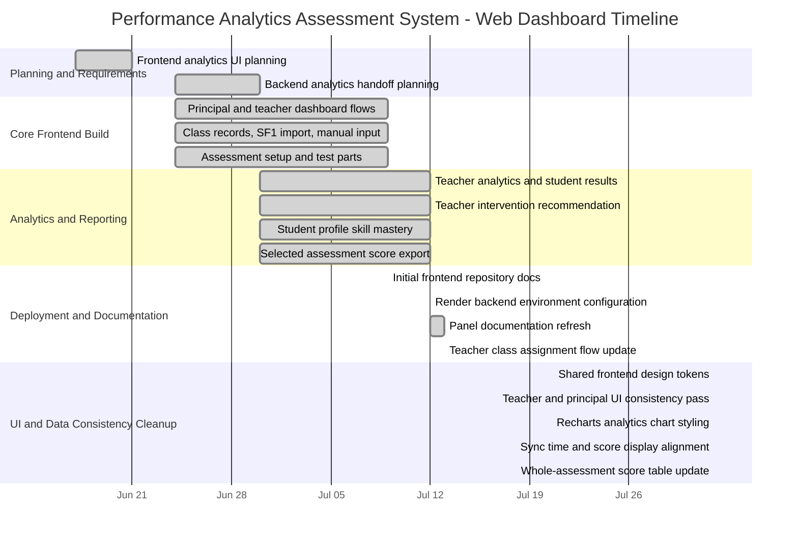

# Project Gantt Chart and Dated Development Timeline

Document created: July 13, 2026  
Last reviewed: July 13, 2026  
Last updated: August 1, 2026  
Coverage period: June 2026 to August 2026

## Date Basis

This timeline uses two date types:

- Repository-verified dates: dates visible from frontend repository history or documentation file updates.
- Approximate project milestone dates: estimated development periods based on frontend/backend handoff notes and recorded implementation discussions.

Use the approximate dates for presentation planning only. Use repository-verified dates when asked for exact documentation dates.

## Gantt Chart

## Dated Work Breakdown

| Date / Period | Workstream | Main Output | Status | Date Basis |
| --- | --- | --- | --- | --- |
| June 2026, third week | Frontend analytics planning | Planned Assessment Setup UI, Competency Tag Library UI, Blueprint Templates UI, Teacher Analytics UI, and trend analytics direction | Completed | Approximate project milestone |
| June 2026, fourth week | Backend analytics and export handoff | Defined teacher intervention, student skill mastery, and selected assessment score export requirements | Completed | Approximate project milestone |
| June 30, 2026 | Backend/frontend analytics handoff | Frontend received endpoint expectations for teacher interventions, student skill mastery, and student score export | Completed | Approximate project milestone |
| July 9, 2026 | Initial frontend repository documentation | Initial README, dashboard documentation, and demo checklist existed in repository history | Completed | Repository-verified |
| July 12, 2026 | Production backend configuration | Documented `VITE_API_URL` for local and Render deployment | Completed | File timestamp / repository history |
| July 12, 2026 | Panel documentation refresh | Updated main web dashboard documentation, demo checklist, and frontend documentation status | Completed | File timestamp |
| July 13, 2026 | Teacher class assignment flow | Updated frontend assignment flow to Teacher -> Subject -> Grade Level -> Section -> Assign, using backend-returned sections only | Completed | Repository working tree |
| July 13, 2026 | Gantt chart documentation | Added this Gantt chart and dated timeline for panel presentation | Completed | Current documentation update |
| August 1, 2026 | Frontend design-system cleanup | Standardized colors, spacing, cards, buttons, table styling, and white-first visual direction using shared design tokens | Completed | Current documentation update |
| August 1, 2026 | Teacher and principal UI pass | Cleaned teacher dashboard/class/analytics views and principal dashboard/class assignment/SF1/analytics/teachers/settings views for consistent layout | Completed | Current documentation update |
| August 1, 2026 | Analytics chart styling | Added Recharts-based chart components for cleaner mastery and assessment visualizations | Completed | Current documentation update |
| August 1, 2026 | Sync and score data display | Aligned sync activity time formatting with backend timestamp data and updated teacher analytics to show whole-assessment student scores | Completed | Current documentation update |

## Panel Explanation

The project followed an incremental development flow. Planning and analytics requirements were finalized first, followed by core frontend workflows for principal and teacher users. After backend analytics endpoints became available, the frontend connected student score analytics, skill mastery, teacher-facing intervention recommendations, and export reports. The August 1 cleanup focused on visual consistency and data clarity: shared design tokens, Recharts charts, Philippine/local sync-time display, and whole-assessment student score presentation.

## Remaining Documentation Items

- Add the final deployed frontend URL after Render deployment.
- Add final screenshots of the deployed frontend pages.
- Add the final system architecture diagram if required by the panel.
- Add a complete user manual with screenshots for principal and teacher users.
